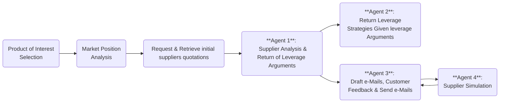

# Tech:Munich Tacto Challenge

This repository contains the code for the Tech:Munich Tacto Challenge.


## Table of Content
1. [Description](#description)
   - [Introduction](#introduction)
   - [How Does It Work](#how-does-it-work)
   - [Main APIs, Frameworks, and Tools](#main-apis-frameworks-and-tools)
2. [Getting Started](#getting-started)
   - [Connect AI Agents](#connect-ai-agents)
   - [Setup Virtual Environment](#setup-virtual-environment)
   - [Create Mock Datase](#create-mock-dataset)

## Description
### Introduction
The supply chain is the backbone of industrial operations, yet many processes remain inefficient, manual, and time-consuming. AI-powered agents have the potential to transform  how businesses interact with suppliers, manage materials, and navigate compliance requirements, ultimately driving smarter decision-making, automation, and efficiency.

The supply chain plays a key role of industrial operations. However, it remains manual and inefficient. Given this problematic we propose AI-agent-based solution to transform how businesses interact with suppliers and request materials.

More specifically, we focus on the potential use cases of **Negotiation Companion** and **Order Agent**. That is: 
- We conduct an initial evaluation of suppliers given a supply of interest and the desired order volume. In this evaluation we provide key metrics to help customers select the best possible suppliers.
- Given suppliers with which the customer wants to negotiate, we analyze historic information, trends that influence the supply price, supply price variation, among others. This with the objective to identify possible negotiation strategies and reach the best possible deal.
- We do not take full control of the negotiations. We suggest ways forward in supply negotiations and draft e-mails that could be sent to suppliers. However, the customer can either accept, scrap or fine-tune our suggestions. 

**SOMEWHERE ADD BENNY'S PRINCIPALS**

### How Does It Work?


### Main APIs, Frameworks, and Tools
For the development of this work we utilized:
- [Mistral AI](https://mistral.ai/): Used API to generate multiple AI agents (Leverage Analyzer, Strategy Formulizer, E-Mail Drafter, Supplier Emulator)
- [Pandas](https://pandas.pydata.org/): Package utilized to generate the synthetic dataset as well as to read and manipulate the dataset.
- [Poetry](https://python-poetry.org/):
- [Streamlit](https://streamlit.io/): Package used for the creation of our demo/GUI
- [Elevenlabs](https://elevenlabs.io/): Used to get the current negotiations prices through a phone call, and then decide wether to accept them or keep negotiating

## Getting Started

### Connect AI Agents
- Use the [Mistral AI console](https://console.mistral.ai/home) to generate your API keys and copy it into the [.env_example](.env_example) file.
- Replace the agent ids environment variables from [.env_example](.env_example) with the ids of your own agents.

### Setup Virtual Environment 

This project uses [Poetry](https://python-poetry.org/) to manage dependencies. Follow these steps to set up the project locally:

1. **Clone the Repository:**
   ```bash
   git clone https://github.com/nifleisch/tech-munich-tacto.git
   cd tech-munich-tacto
   ```

2. **Install Dependencies:**
   Run the following command to create a virtual environment and install all required packages:
   ```bash
   poetry install
   ```

3. **Activate the Virtual Environment:**
   Start the shell within the virtual environment:
   ```bash
   poetry shell
   ```

4. **Run the Application:**
   With the environment activated, you can now run your application. For example:
   ```bash
   python main.py
   ```
   *(Replace `main.py` with the appropriate entry point for your project.)*

5. **Adding New Dependencies:**
   To add additional packages, simply use:
   ```bash
   poetry add <package-name>
   ```

Happy coding!


### Create Mock Dataset

To generate a mock dataset for the project, run the script `dataset/create.py` with the following command:

```bash
python dataset/create.py
```

This will create a mock dataset with 100 events and save it as `dataset/data.csv`. Note that the script will also create the other files in the `dataset` folder that provide further context for the data.
